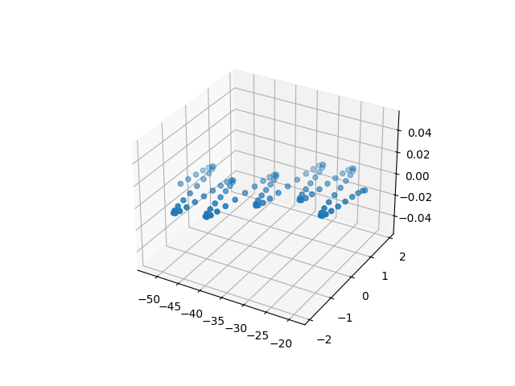
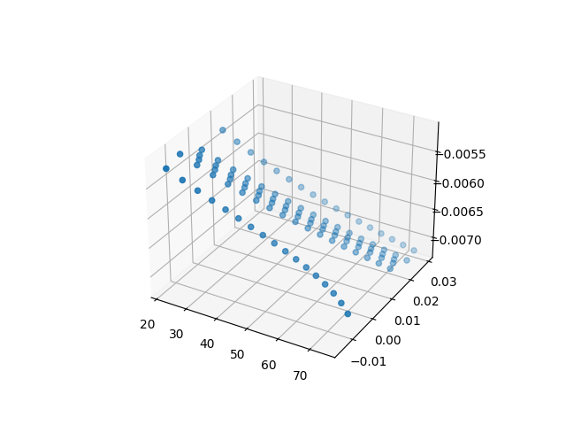
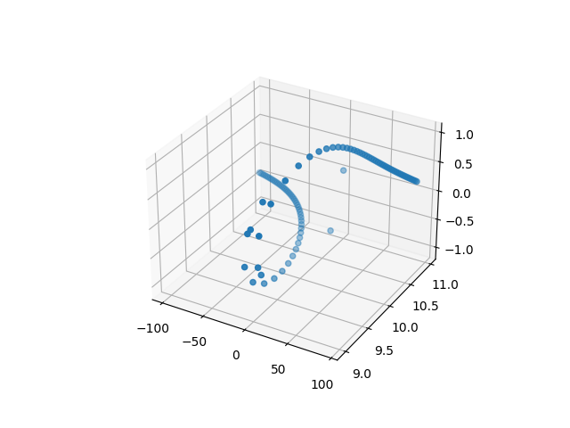

This script generates a random function from the basic operators (+, -, *, /, ^) and a list of functions. Currently supported are sin, cos, tan, exp, ln, and log (of some randomly generated base). Here are some examples:

